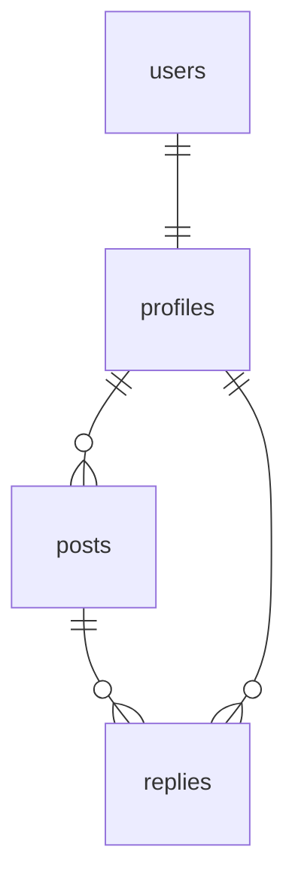
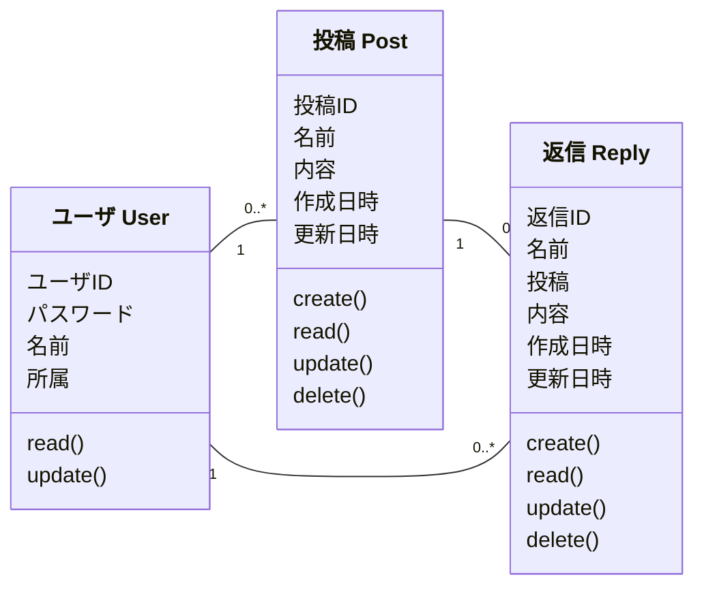
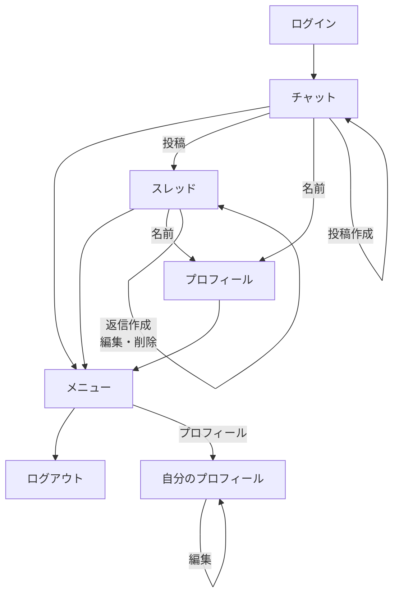
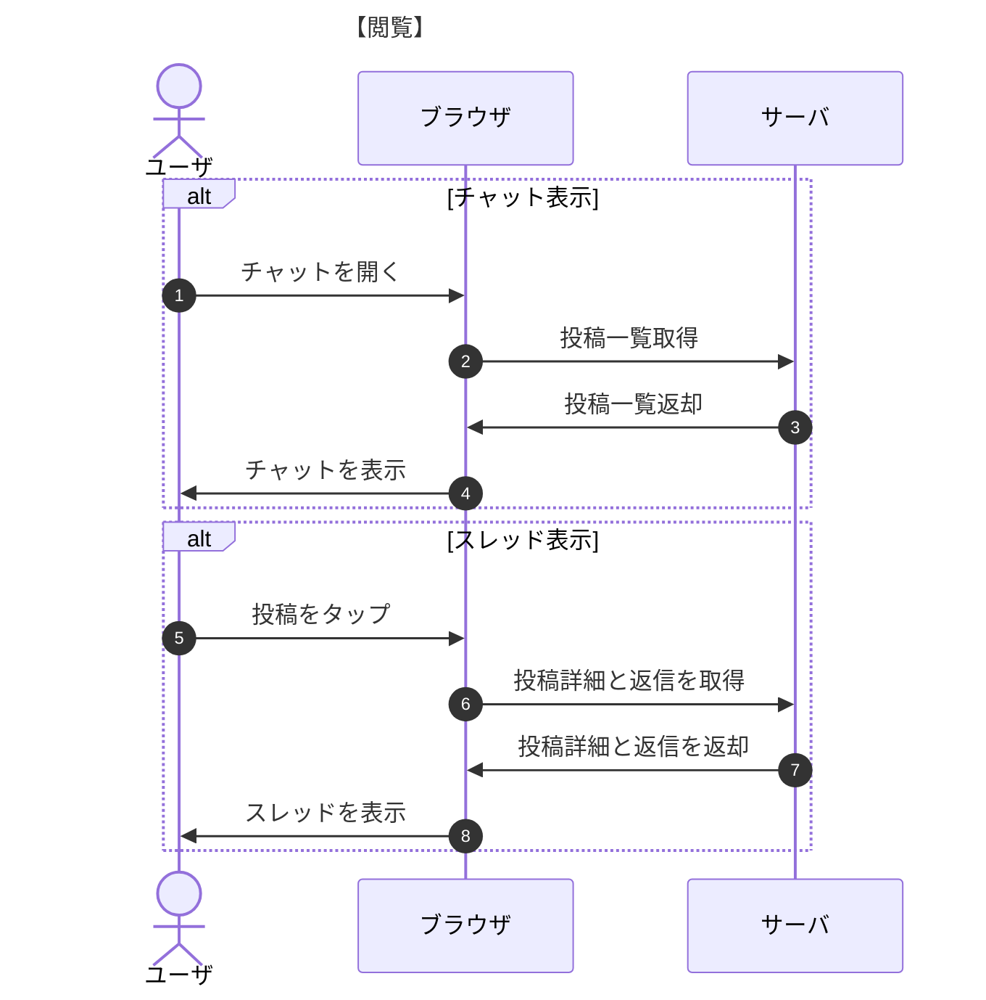
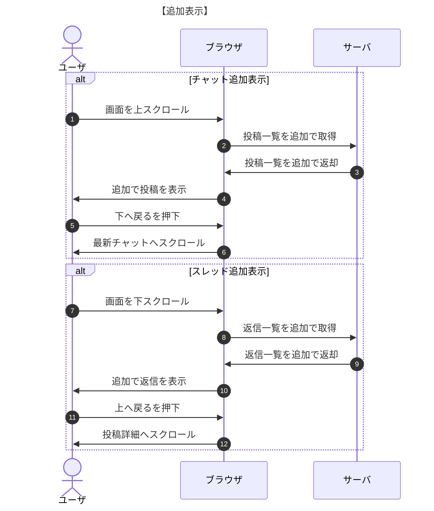
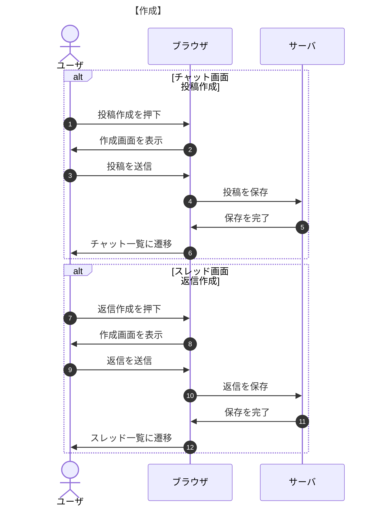
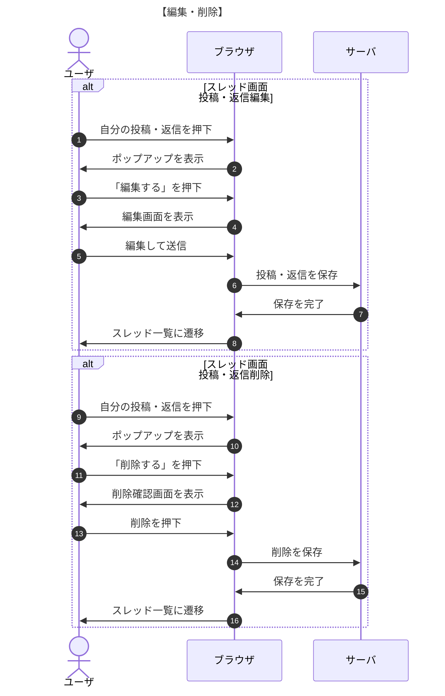
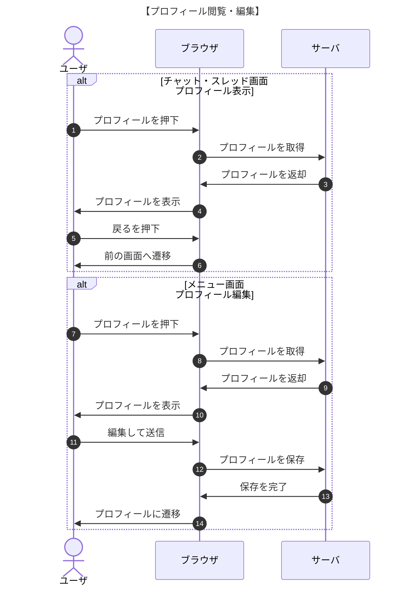
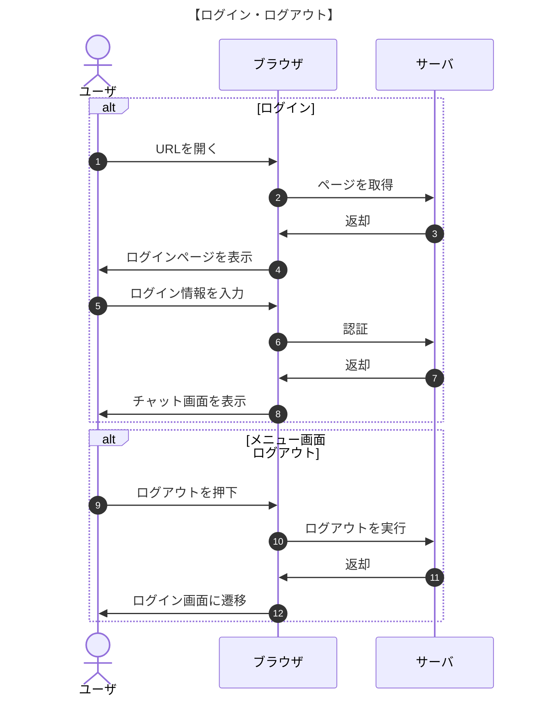

# 災害SOS 詳細設計書
## ER図

```mermaid
erDiagram
    users ||--|| profiles  : ""
    profiles ||--o{ posts : ""
    posts ||--o{ replies : ""
    profiles ||--o{ replies : ""
```
## クラス図

```mermaid
classDiagram
  direction LR
  class `ユーザ User` {
    ユーザID
    パスワード
    名前
    所属
    read()
    update()
  }
  class `投稿 Post` {
    投稿ID
    名前
    内容
    作成日時
    更新日時
    create()
    read()
    update()
    delete()
  }
  class `返信 Reply` {
    返信ID
    名前
    投稿
    内容
    作成日時
    更新日時
    create()
    read()
    update()
    delete()
  }
  `ユーザ User`"1" -- "0..*"`投稿 Post`
  `投稿 Post`"1" -- "0..*"`返信 Reply`
  `ユーザ User`"1" -- "0..*"`返信 Reply`
```
## 画面遷移図

```mermaid
graph
  node_1["ログイン"]
  node_2["チャット"]
  node_3["メニュー"]
  node_4["スレッド"]
  node_5["プロフィール"]
  node_6["ログアウト"]
  node_7["自分のプロフィール"]
  node_4 --> node_3
  node_1 --> node_2
  node_2 --> node_3
  node_2 --"投稿"--> node_4
  node_2 --"名前"--> node_5
  node_4 --"名前"--> node_5
  node_3 --> node_6
  node_3 --"プロフィール"--> node_7
  node_5 --> node_3
  node_2 --"投稿作成"--> node_2
  node_4 --"返信作成\n編集・削除"--> node_4
  node_7 --"編集"--> node_7
```
## シーケンス図
### 投稿・返信 閲覧

```mermaid
---
title: 【閲覧】
---
sequenceDiagram
  autonumber
  actor line_1 as ユーザ
  participant line_2 as ブラウザ
  participant line_3 as サーバ
  alt チャット表示
    line_1 ->> line_2: チャットを開く
    line_2 ->> line_3: 投稿一覧取得
    line_3 ->> line_2: 投稿一覧返却
    line_2 ->> line_1: チャットを表示
  end
  alt スレッド表示
    line_1 ->> line_2: 投稿をタップ
    line_2 ->> line_3: 投稿詳細と返信を取得
    line_3 ->> line_2: 投稿詳細と返信を返却
    line_2 ->> line_1: スレッドを表示
  end
```

### 投稿・返信 追加表示

```mermaid
---
title: 【追加表示】
---
sequenceDiagram
  autonumber
  actor line_1 as ユーザ
  participant line_2 as ブラウザ
  participant line_3 as サーバ
  alt チャット追加表示
    line_1 ->> line_2: 画面を上スクロール
    line_2 ->> line_3: 投稿一覧を追加で取得
    line_3 ->> line_2: 投稿一覧を追加で返却
    line_2 ->> line_1: 追加で投稿を表示
    line_1 ->> line_2: 下へ戻るを押下
    line_2 ->> line_1: 最新チャットへスクロール
  end
  alt スレッド追加表示
    line_1 ->> line_2: 画面を下スクロール
    line_2 ->> line_3: 返信一覧を追加で取得
    line_3 ->> line_2: 返信一覧を追加で返却
    line_2 ->> line_1: 追加で返信を表示
    line_1 ->> line_2: 上へ戻るを押下
    line_2 ->> line_1: 投稿詳細へスクロール
  end
```

### 投稿・返信作成

```mermaid
---
title: 【作成】
---
sequenceDiagram
  autonumber
  actor line_1 as ユーザ
  participant line_2 as ブラウザ
  participant line_3 as サーバ
  alt チャット画面<br>投稿作成
    line_1 ->> line_2: 投稿作成を押下
    line_2 ->> line_1: 作成画面を表示
    line_1 ->> line_2: 投稿を送信
    line_2 ->> line_3: 投稿を保存
    line_3 ->> line_2: 保存を完了
    line_2 ->> line_1: チャット一覧に遷移
  end
    alt スレッド画面<br>返信作成
    line_1 ->> line_2: 返信作成を押下
    line_2 ->> line_1: 作成画面を表示
    line_1 ->> line_2: 返信を送信
    line_2 ->> line_3: 返信を保存
    line_3 ->> line_2: 保存を完了
    line_2 ->> line_1: スレッド一覧に遷移
  end
```

### 投稿・返信 編集・削除

```mermaid
---
title: 【編集・削除】
---
sequenceDiagram
  autonumber
  actor line_1 as ユーザ
  participant line_2 as ブラウザ
  participant line_3 as サーバ
  alt スレッド画面<br>投稿・返信編集
    line_1 ->> line_2: 自分の投稿・返信を押下
    line_2 ->> line_1: ポップアップを表示
    line_1 ->> line_2: 「編集する」を押下
    line_2 ->> line_1: 編集画面を表示
    line_1 ->> line_2: 編集して送信
    line_2 ->> line_3: 投稿・返信を保存
    line_3 ->> line_2: 保存を完了
    line_2 ->> line_1: スレッド一覧に遷移
  end
  alt スレッド画面<br>投稿・返信削除
    line_1 ->> line_2: 自分の投稿・返信を押下
    line_2 ->> line_1: ポップアップを表示
    line_1 ->> line_2: 「削除する」を押下
    line_2 ->> line_1: 削除確認画面を表示
    line_1 ->> line_2: 削除を押下
    line_2 ->> line_3: 削除を保存
    line_3 ->> line_2: 保存を完了
    line_2 ->> line_1: スレッド一覧に遷移
  end
```

### プロフィール閲覧・編集

```mermaid
---
title: 【プロフィール閲覧・編集】
---
sequenceDiagram
  autonumber
  actor line_1 as ユーザ
  participant line_2 as ブラウザ
  participant line_3 as サーバ
  alt チャット・スレッド画面<br>プロフィール表示
    line_1 ->> line_2: プロフィールを押下
    line_2 ->> line_3: プロフィールを取得
    line_3 ->> line_2: プロフィールを返却
    line_2 ->> line_1: プロフィールを表示
    line_1 ->> line_2: 戻るを押下
    line_2 ->> line_1: 前の画面へ遷移
  end
  alt メニュー画面<br>プロフィール編集
    line_1 ->> line_2: プロフィールを押下
    line_2 ->> line_3: プロフィールを取得
    line_3 ->> line_2: プロフィールを返却
    line_2 ->> line_1: プロフィールを表示
    line_1 ->> line_2: 編集して送信
    line_2 ->> line_3: プロフィールを保存
    line_3 ->> line_2: 保存を完了
    line_2 ->> line_1: プロフィールに遷移
  end
```

### ログイン・ログアウト

```mermaid
---
title: 【ログイン・ログアウト】
---
sequenceDiagram
  autonumber
  actor line_1 as ユーザ
  participant line_2 as ブラウザ
  participant line_3 as サーバ
  alt ログイン
    line_1 ->> line_2: URLを開く
    line_2 ->> line_3: ページを取得
    line_3 ->> line_2: 返却
    line_2 ->> line_1: ログインページを表示
    line_1 ->> line_2: ログイン情報を入力
    line_2 ->> line_3: 認証
    line_3 ->> line_2: 返却
    line_2 ->> line_1: チャット画面を表示
  end
  alt メニュー画面<br>ログアウト
    line_1 ->> line_2: ログアウトを押下
    line_2 ->> line_3: ログアウトを実行
    line_3 ->> line_2: 返却
    line_2 ->> line_1: ログイン画面に遷移
  end
```
